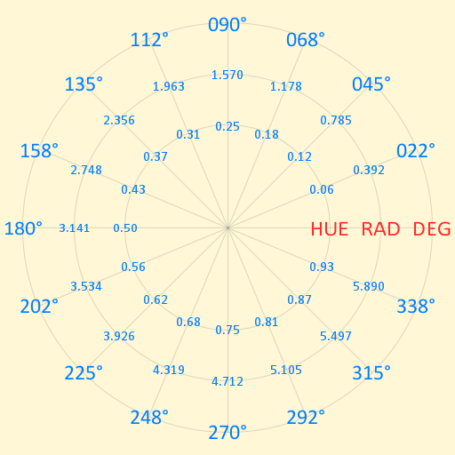

# Welcome to Cam Z-Up

Table of Contents

  1. [Getting Started](#getting-started)
     1. [Installation](#installation)
     2. [Structure](#structure)
     3. [Usage](#usage)
  2. [Differences, Problems](#differences-problems)
     1. [2D & 3D](#2d--3d)
     2. [2D](#2d)
     3. [3D](#3d)
  3. [Math & Geometry Conventions](#math--geometry-conventions)
  4. [Kotlin Interoperability](#kotlin-interoperability)

Cam Z-Up is a Java-based library for the creative coding environment [Processing](https://processing.org/). Cam Z-Up flips Processing's default projection so that the positive z axis, (0.0, 0.0, 1.0), is the world up axis; the positive y axis, (0.0, 1.0, 0.0), is forward. This library supports two- and three-dimensional graphics.

If you can flip the y-axis by either

  - supplying -1.0 to [scale](https://processing.org/reference/scale_.html)'s y parameter or 
  - supplying (0.0, -1.0, 0.0) to the final parameters of [camera](https://processing.org/reference/camera_.html)
  
without negative impact to your sketch, chances are you don't need this library.

While Cam Z-Up can help with more complex sketches, it is a general purpose library. Its aim is to make a number of small tasks easier than in vanilla Processing. It will not be as effective as specialist libraries. For an easy mouse-controlled orbital camera with GUI support, I recommend [peasycam](https://github.com/jdf/peasycam) instead. Other long-standing great libraries are [HE_Mesh](https://github.com/wblut/HE_Mesh) and [ToxicLibs](https://github.com/postspectacular/toxiclibs).

Cam Z-Up is tested with Processing version [4.0 alpha](https://github.com/processing/processing4/releases).

## Getting Started

### Installation

To install this library from Github, 
  1. Click on the green `Code` button in the upper right corner of this repository. 
  2. Select `Download ZIP` to start the download in your browser.
  3. Unzip the download.
  4. Navigate through the directory `distribution/Camzup-1/download` until you find a `CamZup-1.zip` file.
  5. Extract the `.zip` file to to your `Processing/libraries/` folder.
     1. You've got the right folder if it contains the sub-folders `examples`, `library`, `reference`, `src` and the file `library.properties`.
     2. If you don't know the location of your `Processing/libraries` folder, look up the information in the Processing IDE by going to `File > Preferences`.

Alternatively, you can navigate to the the distribution `.zip` on Github and download just the file you need. If you know [Git](https://git-scm.com/) or have [Github Desktop](https://desktop.github.com/), you can use that instead.

### Structure

Cam Z-Up is split into three packages: `pfriendly`, `core` and `kotlin`. The `pfriendly` package contains code compatible with Processing's API. Inside it, you'll find four graphics renderers:

- `Zup3`, which extends `PGraphicsOpenGL`, similar to `P3D`;
- `Yup3`, which also extends `PGraphicsOpenGL`;
- `YupJ2`, which extends `PGraphicsJava2D`, a.k.a. `JAVA2D`, the default Processing renderer based on the Java AWT library;
- `Yup2`, which extends `PGraphicsOpenGL`, similar `P2D`, a "2.5D" renderer;

The `FX2D` renderer, based on Java FX, is not fully supported by Processing, so it's not supported here. The `Yup3` renderer treats the positive y axis, (0.0, 1.0, 0.0), as world up.

This library's `core` package includes basic utilities that were used to modify the Processing renderer. In this package, you'll find classes such as `Vec2`, `Vec3` and `Quaternion`. The division between `pfriendly` and `core` is a protective measure. The aim is to retain the library's usefulness even as bugs in `pfriendly`, or changes to the underlying `Processing` library, cause trouble.

### Usage

With the library installed, you can set up your Processing sketch like so:

```java
// Import the library
import camzup.pfriendly.*;

void settings() {
  // Supply the renderer's path to size as the
  // third argument.
  size(128, 128, YupJ2.PATH_STR);
}
```

More experienced coders may wish to use [createGraphics](https://processing.org/reference/createGraphics_.html) and/or `getGraphics` to access the renderers directly.

```java
import camzup.pfriendly.*;
import camzup.core.*;

YupJ2 rndr;

void settings() {
  size(128, 128, YupJ2.PATH_STR);
}

void setup() {
  rndr = (YupJ2)getGraphics();
}
```

Both `createGraphics` and `getGraphics` return `PGraphics`; the result needs to be cast to the specific renderer. The benefit of accessing Cam Z-Up renderers directly, rather than through `PApplet` functions, is that the renderers offer convenience functions. For example, in the following snippet,

```java
rndr.beginDraw();
rndr.background();
rndr.stroke();
rndr.ellipse(new Vec2(), new Vec2(25.0, 25.0));
rndr.endDraw();
```

`background` and `stroke` use default colors, while `ellipse` and `image` support `Vec2` arguments.

## Differences, Problems



Here is a brief list of issues with this library and differences which may be unexpected. Some are unresolved bugs, some arise from the design philosophy of the library.

### 2D & 3D
  - Flipping axes changes the default rotational direction of a positive angle from clockwise to counter-clockwise.
  - [textureMode](https://processing.org/reference/textureMode_.html) `IMAGE` is not supported by OpenGL renderers; `NORMAL` is the default. This is for three reasons: (1.) the belief that `IMAGE` is _harder_, not easier, to understand; (2.) recognition that `NORMAL` is standard; (3.) redundant operations in `PGraphicsOpenGL` that interfere with [textureWrap](https://processing.org/reference/textureWrap_.html) `REPEAT` and cannot be overidden by this library.
  - In making this conversion, support for high density pixel displays may be lost; I cannot test this at the moment, so please report issues with `image`.
  - The [arc](https://processing.org/reference/arc_.html) implementation has been changed to `mod` the start and stop angles. It no longer responds to [ellipseMode](https://processing.org/reference/ellipseMode_.html); `RADIUS` is the default behavior. When given nonuniform scales, the minimum is taken.
  - The [PShape](https://processing.org/reference/PShape.html) interface has numerous problems stemming from both its implementation and its design. I encourage using `Curve` and `Mesh` objects.
  - [textMode](https://processing.org/reference/textMode_.html) `SHAPE` is not supported. However you can retrieve glyph outlines from a [PFont](https://processing.org/reference/PFont.html) with the `TextShape` class from the `pfriendly` package. (Reminder: the `PFont` needs to be loaded with [createFont](https://processing.org/reference/createFont_.html)).
  - `Curve`s and `Mesh`es do not distinguish between an outline and contour shape. This means they do not properly handle glyphs for characters like 'o', 'p', and 'q'.
  - [shapeMode](https://processing.org/reference/shapeMode_.html) is not supported.
  
### 2D
  - The `image` function for `PGraphicsJava2D` is ineffective, both in terms of frame rate and appearance. I recommend that an OpenGL renderer be used instead. Alternatively, rescale images to display size and tint them in an external application that specializes in raster image manipulation (e.g., [GIMP](https://www.gimp.org/)). I have made an image function which removes some of the padding around the native renderer's image function in cases where a `PImage` can be converted to an AWT image in `setup`.
  - As a consequence of how `image` function works above, dynamic `tint`ing is no longer supported in `YupJ2`.
  - Using `YupJ2`'s `rotate` or `rotateZ` will cause shapes with strokes to jitter.
  - `CORNER` is supported for [rectMode](https://processing.org/reference/rectMode_.html), `ellipseMode` and [imageMode](https://processing.org/reference/imageMode_.html). However it is less intuitive with this library. For that reason, `CENTER` is the default alignment.
  
### 3D
  - A z-up axis changes the relationship between a 2D vector's polar coordinates and a 3D vector's spherical coordinates: a 3D vector's azimuth matches a 2D vector's heading.
  - Neither 3D primitive, the [sphere](https://processing.org/reference/sphere_.html) nor the [box](https://processing.org/reference/box_.html), are supported; use `MeshEntity`s instead.
  - A `Mesh3` material may not have both a fill and a stroke due to flickering in [perspective](https://processing.org/reference/perspective_.html) cameras.

Many core Processing functions are marked `final`, meaning they cannot be extended and modified by classes in this library; many fields are marked `private` meaning they cannot be accessed and/or mutated. This is the one of the reasons for the differences noted above.

## Programming, Mathematical Conventions

With the exception of creating nullable objects, the goal of this library is to create, not throw exceptions. For that reason some liberties have been taken with mathematics.

- Component-wise multiplication between two vectors -- mathematically incorrect -- is assumed to be a shorthand for the multiplication of a vector or point with a non-uniform scalar, which would more appropriately be stored in a matrix.
- `Utils.acos` and `Utils.asin` clamp the input value to the range `-1.0` to `1.0` so as to avoid exceptions.
- As with Python, JavaScript and OSL, `x != 0` is `true`; `true` is `1` and `false` is `0`.
- Where possible, `Vec2`, `Vec3` and `Vec4` parallel GLSL's `bvec`. Examples include: `Vec2 c = Vec2.lt(new Vec2(false, true), new Vec2(true, true));` and `boolean d = Vec2.any(c);`.
- For [modulo operations](https://en.wikipedia.org/wiki/Modulo_operation), I follow the GLSL convention of distinguishing `mod` from `fmod`. `fmod` is based on `trunc`, where `fmod(a, b) := a - b * trunc(a / b)`; `mod`, on `floor`, where `mod(a, b) := a - b * floor(a / b)`. In Java, JavaScript and Kotlin, the `%` operator is `fmod`; in Python, the `%` operator is `mod`.
- As with shader languages, I try to protect against divide-by-zero errors whenever possible. Though mathematically incorrect, `div(x, 0.0) = 0.0` ; in consequence `fmod(x, 0.0)` and `mod(x, 0.0)` return `x`.
- The [linear interpolation](https://en.wikipedia.org/wiki/Linear_interpolation) (`lerp`) method in this library uses the formula `(1.0 - t) * a + t * b`, not `a + t * (b - a)`. Processing uses the latter. Furthermore, Processing's `lerp` is unclamped by default. This library Includes a clamped and unclamped version of `lerp`; clamped is assumed to be the default.
- I break with GLSL convention when it comes to easing functions. The step provided to easing functions is always a scalar (a `float`). There are no `step`, `smoothstep` and `linearstep` functions which generate the step to be supplied to `mix`. `mix` is, however, is defined in relevant classes.
- A quaternion's real component is assumed to be its first element, `{ w, x, y, z }`. Its imaginary components are stored in a vector. This is in contrast to other APIs, for example, Unity's.
- When providing functionality for affine transforms, `Transform2` and `Transform3` are given priority over `Mat3` and `Mat4` in `core`. This is related to the fact that `pfriendly` classes require `PMatrix2D`, `PMatrix3D` or AWT's `AffineTransform`: any functionality added to `Processing` matrix implementations must be copied to `core` matrices, even though the latter aren't used as much.
- The convention established by Java's `indexOf` function is to return `-1` when an array or collection does not contain a query. Some collections in this library, particularly `Mesh`s and `Curve`s, match Pythonic idiom insofar as they accept negative indices to `get` functions. For example, `curve.get(-1)` will return the last `Knot` in a curve, provided that it is a `closedLoop`. As a consequence, the reciprocity between Java's `indexOf` and `get` is broken. For example: `curve.get(curve.knots.indexOf(elmNotInCurve)) != elmNotInCurve`. For this reason, `contains` should always be preferred over `indexOf`, and no custom `contains` method should depend on `indexOf` unless `get`s definition is guaranteed.

## Kotlin Interoperability

This library's `core` was originally designed to affiliate with Processing's code design. With exceptions, classes are defined to be mutable and extensible. Methods are at most `protected` and fields are public (no getters or setters). `static` methods are preferred where possible, and use the out parameter antipattern.

As of v 0.6, this library provides limited interoperability with [Kotlin](https://kotlinlang.org/), specifically [operator overloading](https://kotlinlang.org/docs/reference/operator-overloading.html). As of v 0.7, this support is sectioned off in `camzup.kotlin`, where a Kotlin friendly class extends a core class; for example, `KtVec2` is a child of `Vec2`. Kotlin does not use `static` methods; instance methods do not always mutate the instance in place; and naming conventions differ to those of this library.

For those reasons, the following functions may be confusing if used in Processing-Java.

| Kotlin Operator |            Interop Method | Mutator | KtVec | KtComplex | KtQuat | KtClr | KtMat |
| --------------: | ------------------------: | :-----: | :---: | :-------: | :----: | :---: | :---: |
|            `+a` |         `T a.unaryPlus()` |         |   X   |     X     |   X    |   X   |   X   |
|            `-a` |        `T a.unaryMinus()` |         |   X   |     X     |   X    |   X   |   X   |
|            `!a` |               `T a.not()` |         |   X   |           |        |       |   X   |
|    `++a`, `a++` |               `T a.inc()` |         |   X   |           |        |   X   |       |
|    `--a`, `a--` |               `T a.dec()` |         |   X   |           |        |   X   |       |
|         `a + b` |           `T a.plus(U b)` |         |   X   |     X     |   X    |   X   |   X   |
|         `a - b` |          `T a.minus(U b)` |         |   X   |     X     |   X    |   X   |   X   |
|         `a * b` |          `T a.times(U b)` |         |   X   |     X     |   X    |   X   |   X   |
|         `a / b` |            `T a.div(U b)` |         |   X   |     X     |   X    |   X   |   X   |
|         `a % b` |            `T a.rem(U b)` |         |   X   |           |        |   X   |       |
|        `a += b` |  `void a.plusAssign(U b)` |    X    |   X   |     X     |   X    |   X   |   X   |
|        `a -= b` | `void a.minusAssign(U b)` |    X    |   X   |     X     |   X    |   X   |   X   |
|        `a *= b` | `void a.timesAssign(U b)` |    X    |   X   |     X     |   X    |   X   |   X   |
|        `a /= b` |   `void a.divAssign(U b)` |    X    |   X   |     X     |   X    |   X   |   X   |
|        `a %= b` |   `void a.remAssign(U b)` |    X    |   X   |           |        |   X   |       |
|        `a in b` | `boolean b.contains(U a)` |         |   X   |     X     |   X    |   X   |   X   |
|          `a[i]` |          `U a.get(int i)` |         |   X   |     X     |   X    |   X   |   X   |
|          `a[i]` |  `void a.set(int i, U b)` |    X    |       |           |        |       |   X   |

Operations between all the objects above are subject to ambiguity. Do not, for example, assume commutativity for operators (meaning, do not assume that `a * b` will yield a result equal in value to `b * a`). Even when an operator is not supported by `core`, Kotlin may infer a viable alternative, e.g., `+` may coerce both the left and right operand to a collection, then concatenate the two.

Operators should never be assumed to be more efficient than named methods in languages where objects are allowed to override operators. For example, to divide complex numbers, quaternions or matrices, the denominator's inverse has to be calculated. Always read the language's documentation and do not prematurely optimize.

There are more differences between Kotlin and Processing-Java than can be discussed here, please see the Kotlin documentation above for more information.