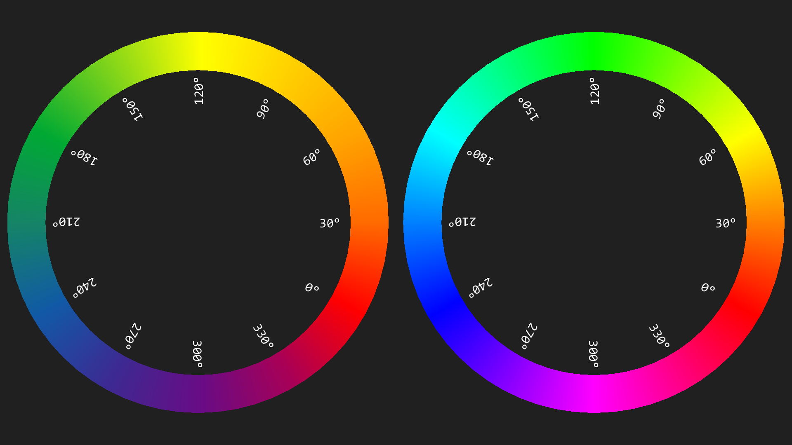
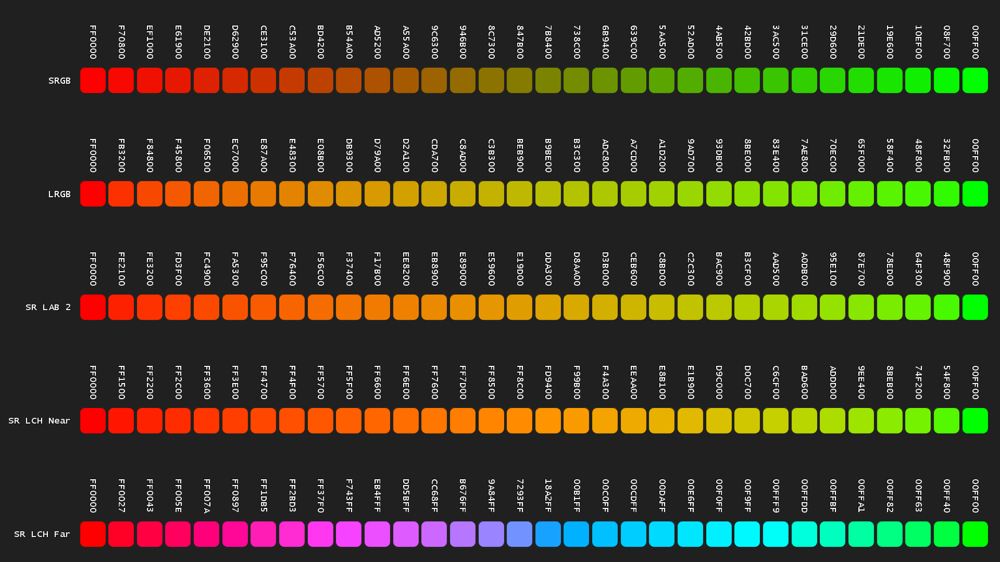
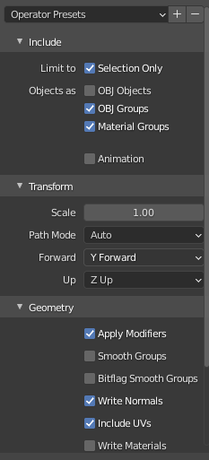

# Welcome to Cam Z-Up

Table of Contents

- [Welcome to Cam Z-Up](#welcome-to-cam-z-up)
  - [Getting Started](#getting-started)
    - [Installation](#installation)
    - [Structure](#structure)
    - [Usage](#usage)
    - [Chirality](#chirality)
    - [Color](#color)
      - [Palettes](#palettes)
      - [Harmony](#harmony)
      - [Complement Mix Test](#complement-mix-test)
  - [File Import \& Export](#file-import--export)
    - [GPL](#gpl)
    - [GGR](#ggr)
    - [OBJ](#obj)
    - [SVG](#svg)
  - [Differences, Problems](#differences-problems)
    - [2D \& 3D](#2d--3d)
    - [2D](#2d)
    - [3D](#3d)
  - [Programming, Math Conventions](#programming-math-conventions)
  - [Kotlin Interoperability](#kotlin-interoperability)

Cam Z-Up is a Java-based library for the creative coding environment [Processing](https://processing.org/). Cam Z-Up flips Processing's default projection so that the positive z axis, (0.0, 0.0, 1.0), is the world up axis; the positive y axis, (0.0, 1.0, 0.0), is forward. The world origin, (0.0, 0.0, 0.0), is placed at the center of a sketch.

This library supports two- and three-dimensional graphics. In 2D, if the camera is imagined to be above the sketch looking down, the positive y axis is forward. If the camera is imagined to be looking from a sideview, the y axis is up.

If you can flip the y axis by either

  - supplying -1.0 to [scale](https://processing.org/reference/scale_.html)'s y parameter or 
  - supplying (0.0, -1.0, 0.0) to the final parameters of [camera](https://processing.org/reference/camera_.html)
  
without negative impact to your sketch, chances are you don't need this library.

While Cam Z-Up can help with more complex sketches, it is a general purpose library. It aims to make a number of small tasks easier than in vanilla Processing. It will not be as effective as specialist libraries. For an easy mouse-controlled orbital camera with GUI support, I recommend [peasycam](https://github.com/jdf/peasycam) instead. Other great libraries are [HE_Mesh](https://github.com/wblut/HE_Mesh) and [ToxicLibs](https://github.com/postspectacular/toxiclibs).

Cam Z-Up is tested with Processing version [4.x](https://github.com/processing/processing4/releases).

## Getting Started

For more thorough information, please refer to the documentation included within the distribution. For examples, see the `examples` directory.

### Installation

To install this library from Github, 

  1. Click on the green `Code` button in the upper right corner of this repository. 
  2. Select `Download ZIP` to start the download in your browser.
  3. Unzip the download.
  4. Navigate through the directory `distribution/Camzup-1/download` until you find a `CamZup-1.zip` file.
  5. Extract the `.zip` file to to your `Processing/libraries/` folder.
     1. You've got the right folder if it contains the sub-folders `examples`, `library`, `reference`, `src` and the file `library.properties`.
     2. If you don't know the location of your `Processing/libraries` folder, look up the information in the Processing IDE by going to `File > Preferences`.

Alternatively, you can navigate to the the distribution `.zip` on Github and download just the file you need. If you know [Git](https://git-scm.com/) or have [Github Desktop](https://desktop.github.com/), you can use that instead.

### Structure

Cam Z-Up is split into three packages: `core`, `pfriendly` and `kotlin`. The `pfriendly` package contains code compatible with Processing's API. Inside it, you'll find four graphics renderers:

- `Yup3`, which extends `PGraphicsOpenGL`, similar to `P3D`;
- `Zup3`, which also extends `PGraphicsOpenGL`;
- `YupJ2`, which extends `PGraphicsJava2D`, a.k.a. `JAVA2D`, the default Processing renderer based on the Java AWT library;
- `Yup2`, which extends `PGraphicsOpenGL`, similar to `P2D`, a "2.5D" renderer;

The `FX2D` renderer, based on Java FX, is not distributed with Processing, so it's not supported here. The `Yup3` renderer treats the positive y axis, (0.0, 1.0, 0.0), as world up.

This library's `core` package includes basic utilities that were used to modify the Processing renderer. In this package, you'll find classes such as `Vec2`, `Vec3` and `Quaternion`. The division between `pfriendly` and `core` is a protective measure. The aim is to retain the library's usefulness even as bugs in `pfriendly`, or changes to the underlying `Processing` library, cause trouble.

### Usage

With the library installed, you can set up your Processing sketch like so:

```java
// Import the library
import camzup.pfriendly.*;

void settings() {
  // Supply the renderer's path to size as the
  // third argument.
  size(128, 128, YupJ2.PATH_STR);
}
```

More experienced coders may wish to use [createGraphics](https://processing.org/reference/createGraphics_.html) and/or `getGraphics` to access the renderers directly.

```java
import camzup.pfriendly.*;
import camzup.core.*;

YupJ2 graphics;

void settings() {
  size(128, 128, YupJ2.PATH_STR);
}

void setup() {

  // For OpenGL on Macs.
  frameRate(60.0);

  // Cast from PGraphics to your renderer.
  graphics = (YupJ2)getGraphics();
}
```

Both `createGraphics` and `getGraphics` return `PGraphics`; the result needs to be cast to the specific renderer. The benefit of accessing Cam Z-Up renderers directly, rather than through `PApplet`, is that the renderers offer additional conveniences. For example, in the following snippet,

```java
graphics.beginDraw();
graphics.background();
graphics.stroke();
graphics.ellipse(new Vec2(), new Vec2(25.0, 25.0));
graphics.endDraw();
```

`background` and `stroke` use default colors, while `ellipse` and `image` support `Vec2` arguments.

### Chirality

Flipping the y axis changes the default rotational direction of a positive angle from clockwise to counter-clockwise.


This can be crucial when working with signed angles, such as those returned from `Vec2.headingSigned` or `Utils.atan2`, as it's important to understand the relationship between polar coordinates and the four quadrants of the Cartesian coordinate plane.


Signed angles can be converted to unsigned angles with [floor modulo](https://en.wikipedia.org/wiki/Modulo_operation), `mod`. This should not be confused with truncation modulo, `fmod`. In Processing's Java mode, `%` is truncation modulo; in Python mode, `%` is floor modulo.

Vertex winding is also affected. Below, a piecewise Bezier curve is used to approximate a circle. The central contour uses the opposite (clockwise) vertex winding.


A renderer's vertex winding rule will dictate the fill of contours with the same winding. For more information, see the [non-zero](https://en.wikipedia.org/wiki/Nonzero-rule) and the [even-odd](https://en.wikipedia.org/wiki/Even%E2%80%93odd_rule) rule.

In 3D, the orientation of a spherical coordinate system depends on the up axis. For z-up, the equator of a spherical system rests on the camera's horizon; for y-up, the poles rest on the camera's horizon. The image below shows z-up.


Negative inclinations, in the range [`-PI / 2.0`, `0.0`] will fall beneath the equator; positive inclinations, in the range [`0.0`, `PI / 2.0`], will fall above the equator. An inclination of `-PI / 2.0` will return the South pole; an inclination of `PI / 2.0` will return the North pole. A positive azimuth will head East from the prime meridian; a negative azimuth will head West.

In OpenGL renderers, texture coordinates default to `NORMAL` [textureMode](https://processing.org/reference/textureMode_.html). `IMAGE` is not supported. This is for three reasons: (1.) the belief that `IMAGE` is harder, not easier, to understand; (2.) recognition that `NORMAL` is standard; (3.) methods in `PGraphicsOpenGL` interfere with [textureWrap](https://processing.org/reference/textureWrap_.html) `REPEAT` and cannot be overidden by this library. That aside, as per usual, texture coordinates begin at (0.0, 0.0) in the top-left corner and end at (1.0, 1.0) in the bottom-right corner of the image.

### Color

I am not a color scientist, nor do I pretend to be. Color is not the central focus of this library and I'm not interested in debating the "correct" way to mix it. Do not use this library for advanced or photorealistic color work. However, vanilla Processing's approach to color can't not be addressed, so I've introduced enough to allow users to get the job done, namely an RGBA `Color` and `Gradient` class.

#### Palettes

The `Gradient` class allows you to create color ramps, including the following:


Viridis and Magma are color palettes used in data visualizations. [Sepia](https://www.wikiwand.com/en/Sepia_(color)) and [cyanotype](https://en.wikipedia.org/wiki/Cyanotype) replicate older photographic printing processes.

#### Harmony

RYB color is included above because popular tutorials on "Color Harmony" (or "Color Theory") often assume a subtractive red-yellow-blue color model, even in the context of digital media. Processing defaults to additive sRGB, where cyan (`#00ffff`) is the complement of red (`#ff0000`), not green. This holds regardless of whether you use the `HSB` or the `RGB` [colorMode](https://processing.org/reference/colorMode_.html).



This RYB wheel's limitations should be apparent from the above. Oranges are dilated while blues are compressed. Brighter greens, cyans and magentas are not achievable. Blues and greens are desaturated. [This](https://youtu.be/YeI6Wqn4I78) tutorial on harmonies is one of the better I've found.

#### Complement Mix Test

A quick heuristic to decide if you are blending colors as you prefer is to take two complementary colors - typically red and green - which you predict will yield an ugly blend and sample them.



A hue mix can be either counter-clockwise or clockwise. Do not use `Utils.clamp01` to confine a hue to [0.0, 1.0], use `Utils.mod1` instead. Converting sRGB to linear RGB, interpolating, then converting back is computationally expensive. If you don't like what you see, you can create your own mixing function by `extend`ing the class `Color.AbstrEasing`.

```java
class Foo extends Color.AbstrEasing {
  Color applyUnclamped(Color a, Color b, Float t, Color target) {
    return target;
  }
}
```
You will need to override the method `applyUnclamped`.

## File Import & Export

For file I/O, some general comments: (1.) writing a file is easier than reading files written by others; (2.) to support a file format, a data structure in the library must more or less replicate it in working memory; (3.) the stricter a file format specification is, the better; (4.) almost all file format support is partial; (5.) from 3 and 4, the more kinds of information a file format claims to store, the harder it is to import and replicate it; (6.) commercial interests dictate what formats can and cannot be supported.

Specific to Processing import: methods like `loadImage` and `loadShape` have access to the sketch's path; this library doesn't. Either prepend the `String` returned by `sketchPath` to file names or create a [BufferedReader](https://processing.org/reference/BufferedReader.html).

### GPL

This library supports the GIMP palette format (`.gpl`) because it is human readable, human writable and is also supported by [Lospec](https://lospec.com/). To export a palette, provide an array of `Color`s to `Color.toGplString`.

```java
import camzup.core.*;

void setup() {
  Gradient rgb = Gradient.paletteRgb(new Gradient());
  Color[] palette = rgb.toArray();
  String gplstr = Color.toGplString(palette, "My RGB");
  saveStrings("rgb.gpl", new String[] { gplstr });
}
```

This generates the file below. A header is followed by a name, the number of columns to use when displaying the palette and a comment preceded by a `#`. The color is broken into red, green and blue color channels; each channel is formatted as an unsigned byte in [0, 255] separated by a space. This is followed by a name, for which this library writes the color's hexadecimal representation. Last is an index for the color; this library begins the index at 1, not 0. The name and index of a palette entry may be optional for some importers, mandatory for others.
 
```
GIMP Palette
Name: My RGB
Columns: 1
# Comment.
255 0 0 FF0000 1
255 255 0 FFFF00 2
0 255 0 00FF00 3
0 255 255 00FFFF 4
0 0 255 0000FF 5
255 0 255 FF00FF 6
255 0 0 FF0000 7
```

To import a GPL file, use `ParserGpl.load` to return an array of `Color`s. Names for colors are not preserved. Due to the simillarity between `.gpl` and the JASC-PAL (`.pal`) format, the parser should also be able to handle those files as well.

### GGR

Support for the GIMP gradient format (`.ggr`) is partial. GIMP gradient color keys store a color at the left edge, right edge and median. This allows for both sharp edges and smooth transitions between color keys. Furthermore, it allows a GIMP gradient to meaningfully contain only one key, such as a HSB ramp that goes from red to red clockwise. CamZup gradients store only one color per key, and require a minimum of two keys. As of November 2022, HSB is no longer supported

For these reasons, upon import a GIMP gradient's keys are not transferred one-to-one; rather, the gradient is sampled at a resolution: `Gradient grd = ParserGgr.load(sketchPath() + "\\data\\filename.ggr", 16);`.

To export, use code like this

```java
import camzup.core.*;

void setup() {
  Gradient ryb = Gradient.paletteRyb(new Gradient());
  String ggrstr = ryb.toGgrString("My Ryb", 0, 1);
  saveStrings("ryb.ggr", new String[] { ggrstr });
}
```

to generate a file like this

```
GIMP Gradient
Name: My Ryb
12
0.0 0.041666 0.083333 1.0 0.0 0.0 1.0 1.0 0.25 0.0 1.0 0 1
0.083333 0.125 0.166666 1.0 0.25 0.0 1.0 1.0 0.5 0.0 1.0 0 1
0.166666 0.208333 0.25 1.0 0.5 0.0 1.0 1.0 0.75 0.0 1.0 0 1
0.25 0.291666 0.333333 1.0 0.75 0.0 1.0 1.0 1.0 0.0 1.0 0 1
0.333333 0.375 0.416666 1.0 1.0 0.0 1.0 0.505882 0.831372 0.101960 1.0 0 1
0.416666 0.458333 0.5 0.505882 0.831372 0.101960 1.0 0.0 0.662745 0.2 1.0 0 1
0.5 0.541666 0.583333 0.0 0.662745 0.2 1.0 0.082352 0.517647 0.4 1.0 0 1
0.583333 0.625 0.666666 0.082352 0.517647 0.4 1.0 0.164705 0.376471 0.6 1.0 0 1
0.666666 0.708333 0.75 0.164705 0.376471 0.6 1.0 0.333333 0.188235 0.552941 1.0 0 1
0.75 0.791666 0.833333 0.333333 0.188235 0.552941 1.0 0.5 0.0 0.5 1.0 0 1
0.833333 0.875 0.916666 0.5 0.0 0.5 1.0 0.75 0.0 0.25 1.0 0 1
0.916666 0.958333 1.0 0.75 0.0 0.25 1.0 1.0 0.0 0.0 1.0 0 1
```

Unlike a `.gpl`, a `.ggr`'s color channels are in [0.0, 1.0]. A GIMP gradient requires its key(s) to fill the expanse from `0.0` to `1.0`, the gradient's extrema; a CamZup gradient does not. GIMP gradients use integer constants to indicate color mode and easing function so those can be supplied; they default to `0` and `0` for RGB linear. `.ggr` files can be imported by [Inkscape](https://inkscape.org/).

### OBJ

The Wavefront `.obj` file format is human readable; an overview of the particulars can be found at [Wikipedia](https://www.wikiwand.com/en/Wavefront_.obj_file). It can support a broad array of data, including poly-lines and Bezier surfaces. This library recognizes only meshes. The material library files associated with `.obj`s are not supported for three reasons: (1.) different renderers have different capacities to display materials, so this library separates these concerns; (2.) the information stored by `.mtl` files is outdated relative to modern materials; (3.) Processing's lighting and materials pipeline is limited.

Import functionality is tested against [Blender](https://www.blender.org/) exports. For best results, use the following:



Limit export to `Selection Only`. Depending on whether the export contains multiple objects, or one object with multiple material groups, separate the relevant category by `g` group headers. The `Transform` should match the axes of the `Zup3` or `Yup3` renderer. `Write Materials` should be unchecked; `Write Normals` and `Include UVs` should be checked.

`.obj`s can be exported via `MeshEntity2` and `MeshEntity3`'s `toObjString` methods. They are imported to `MeshEntity3`s via `ParserObj.load`. Because `Mesh3`s store data by reference, not by copy, the `load` method includes a flag to indicate whether each created `Mesh3` should have its own copy of the `v`, `vt` and `vn` data. For export, an entity is treated as an `o` object, while a mesh is a `g` group; an entity's transform is not applied to the meshes it holds.

### SVG

This library's scalable vector graphics (SVG) import method is adapted from Processing's. As such, it's quite limited. All material attributes (stroke weight, stroke, fill) are ignored. For best results, remove any `?xml` tags from the top of the SVG file; refrain from any suffixes that specify units of measure (cm, px, %, etc.); and do not use `def`s tags. `ParserSvg.load` returns a `CurveEntity2`. To save a `String` as an SVG, supply entities and materials to the `toSvgString` method of `Yup2` or `YupJ2`. Whether a `Curve2` is rendered as a path or sub-path depends on the number of materials per curve. A `Mesh2` face is treated as a sub-path. Because import does not interpret `def`s, an exported SVG will not be as efficient as it could otherwise be.

## Differences, Problems

Here is a brief list of issues with this library and differences which may be unexpected. Some are unresolved bugs, some arise from the design philosophy of the library.

### 2D & 3D
  
  - Support for high density pixel displays may be lost; I cannot test this at the moment, so please report issues with `image`.
  - The [arc](https://processing.org/reference/arc_.html) implementation has been changed to `mod` the start and stop angles. It no longer responds to [ellipseMode](https://processing.org/reference/ellipseMode_.html); `RADIUS` is the default behavior. When given nonuniform scales, the minimum is taken.
  - The [PShape](https://processing.org/reference/PShape.html) class has numerous problems stemming from both its implementation and its design. I encourage using `CurveEntity` and `MeshEntity` objects excepting the case where high poly count `PShapeOpenGL`s are more performant.
  - [shapeMode](https://processing.org/reference/shapeMode_.html) is not supported.
  - [textMode](https://processing.org/reference/textMode_.html) `SHAPE` is not supported. However you can retrieve glyph outlines from a [PFont](https://processing.org/reference/PFont.html) with the `TextShape` class from the `pfriendly` package. (Reminder: the `PFont` needs to be loaded with [createFont](https://processing.org/reference/createFont_.html)).
  - Color methods no longer promote `int`s in `[0, 255]` to gray colors. Use `float`s or `Color` objects instead.
  
### 2D
  - The `image` function for `PGraphicsJava2D` is ineffective, both in terms of frame rate and appearance. I recommend that an OpenGL renderer be used instead. Alternatively, rescale images to display size and tint them in a raster image editor. I have made an image function which removes some of the padding around the native renderer's image function in cases where a `PImage` can be converted to a `java.awt.Image` in `setup`.
  - As a consequence of how `image` function works above, dynamic `tint`ing is no longer supported in `YupJ2`.
  - Using `YupJ2`'s `rotate` or `rotateZ` will cause shapes with strokes to jitter.
  - `CORNER` is supported for [rectMode](https://processing.org/reference/rectMode_.html), `ellipseMode` and [imageMode](https://processing.org/reference/imageMode_.html). However it is less intuitive with this library. For that reason, `CENTER` is the default alignment.
  - OpenGL renderers do not recognize contours in meshes and curves.
  
### 3D
  - Neither 3D primitive, [sphere](https://processing.org/reference/sphere_.html) and [box](https://processing.org/reference/box_.html), are supported; use `MeshEntity3`s instead.
  - A `Mesh3` material may not have both a fill and a stroke due to flickering in [perspective](https://processing.org/reference/perspective_.html) cameras.

Many core Processing functions are marked `final`, meaning they cannot be extended and modified by classes in this library; many fields are marked `private` meaning they cannot be accessed and/or mutated. This is the one of the reasons for the limitations above.

## Programming, Math Conventions

`null`-checks excepted, the goal of this library is not to throw exceptions, but to create. For that reason some liberties have been taken with mathematics.

- `acos` and `asin` clamp the input value to the range `-1.0` to `1.0` so as to avoid exceptions.
- As with Python, JavaScript and OSL, `x != 0` is `true`; `true` is `1` and `false` is `0`.
- Where possible, `Vec2`, `Vec3` and `Vec4` parallel GLSL's `bvec`. Examples include: `Vec2 c = Vec2.lt(new Vec2(false, true), new Vec2(true, true));` and `boolean d = Vec2.any(c);`.
- As with shader languages, I try to protect against divide-by-zero errors when possible. Though mathematically incorrect, `div(x, 0.0) = 0.0` ; in consequence `fmod(x, 0.0)` and `mod(x, 0.0)` return `x`.
- Unlike GLSL, `fract` is defined as `x - trunc(x)`, not `x - floor(x)`. This library refers to the latter as `mod1`.
- The [linear interpolation](https://en.wikipedia.org/wiki/Linear_interpolation) (`lerp`) method in this library uses the formula `(1.0 - t) * a + t * b`, not `a + t * (b - a)`. Processing uses the latter. Furthermore, Processing's `lerp` is unclamped by default. This library Includes a clamped and unclamped version of `lerp`; clamped is assumed to be the default.
- The step provided to easing functions is always a scalar (a `float`). There are no `step`, `smoothstep` and `linearstep` functions which generate the step to be supplied to `mix`. `mix` is, however, is defined in relevant classes.
- A quaternion's real component is assumed to be its first element, `{ w, x, y, z }`. Its imaginary components are stored in a vector. This is in contrast to other APIs, such as [Unity](https://docs.unity3d.com/ScriptReference/Quaternion.html)'s.
- The convention established by Java's `indexOf` function is to return `-1` when an array or collection does not contain a query. Some collections in this library, particularly `Mesh`s and `Curve`s, match Pythonic idiom insofar as they accept negative indices to `get` functions. For example, `curve.get(-1)` will return the last `Knot` in a curve, provided that it is a `closedLoop`. As a consequence, the reciprocity between Java's `indexOf` and `get` is broken. For example: `curve.get(curve.knots.indexOf(elmNotInCurve)) != elmNotInCurve`. For this reason, `contains` should always be preferred over `indexOf`, and no custom `contains` method should depend on `indexOf` unless `get`s definition is guaranteed.
- Between two vectors, the [Hadamard product](https://www.wikiwand.com/en/Hadamard_product_(matrices)), is the default multiplication associated with the `*` operator.

## Kotlin Interoperability

This library's `core` was originally designed to affiliate with Processing's code design. With exceptions, classes are defined to be mutable and extensible. Methods are at most `protected` and fields are public (no getters or setters). `static` methods are preferred where possible, and use the out parameter antipattern.

As of v 0.6, this library provides limited interoperability with [Kotlin](https://kotlinlang.org/), specifically [operator overloading](https://kotlinlang.org/docs/reference/operator-overloading.html). As of v 0.7, this support is sectioned off to `camzup.kotlin`, where a Kotlin friendly class extends a core class; for example, `KtVec2` extends `Vec2`. Kotlin does not use `static` methods; instance methods do not always mutate the instance in place; and naming conventions differ to those of this library.

| Kotlin Operator |            Interop Method | Mutator | KtVec | KtComplex | KtQuat | KtMat |
| --------------: | ------------------------: | :-----: | :---: | :-------: | :----: | :---: |
|            `+a` |         `T a.unaryPlus()` |         |   X   |     X     |   X    |   X   |
|            `-a` |        `T a.unaryMinus()` |         |   X   |     X     |   X    |   X   |
|            `!a` |               `T a.not()` |         |   X   |           |        |   X   |
|    `++a`, `a++` |               `T a.inc()` |         |   X   |           |        |       |
|    `--a`, `a--` |               `T a.dec()` |         |   X   |           |        |       |
|         `a + b` |           `T a.plus(U b)` |         |   X   |     X     |   X    |   X   |
|         `a - b` |          `T a.minus(U b)` |         |   X   |     X     |   X    |   X   |
|         `a * b` |          `T a.times(U b)` |         |   X   |     X     |   X    |   X   |
|         `a / b` |            `T a.div(U b)` |         |   X   |     X     |   X    |   X   |
|         `a % b` |            `T a.rem(U b)` |         |   X   |           |        |       |
|        `a += b` |  `void a.plusAssign(U b)` |    X    |   X   |     X     |   X    |   X   |
|        `a -= b` | `void a.minusAssign(U b)` |    X    |   X   |     X     |   X    |   X   |
|        `a *= b` | `void a.timesAssign(U b)` |    X    |   X   |     X     |   X    |   X   |
|        `a /= b` |   `void a.divAssign(U b)` |    X    |   X   |     X     |   X    |   X   |
|        `a %= b` |   `void a.remAssign(U b)` |    X    |   X   |           |        |       |
|        `a in b` | `boolean b.contains(U a)` |         |   X   |     X     |   X    |   X   |
|          `a[i]` |          `U a.get(int i)` |         |   X   |     X     |   X    |   X   |
|          `a[i]` |  `void a.set(int i, U b)` |    X    |       |           |        |   X   |

Operations between all the objects above are subject to ambiguity. Do not, for example, assume commutativity for operators (`a * b` will not always yield a result equal in value to `b * a`). Even when an operator is not supported by `camzup.kotlin`, Kotlin may infer a viable alternative, e.g., `+` may coerce both the left and right operand to a collection, then concatenate the two. Operators should never be assumed to be more efficient than named methods in languages where objects are allowed to override operators. 

There are more differences between Kotlin and Processing-Java than can be discussed here, please see the Kotlin documentation above for more information.